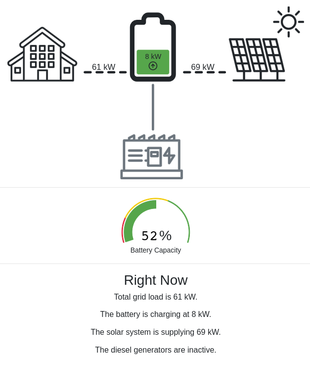
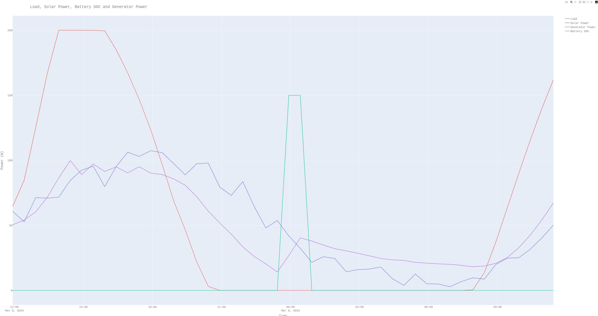
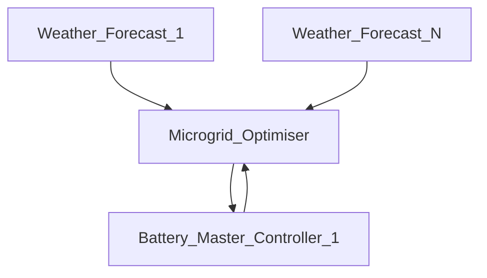
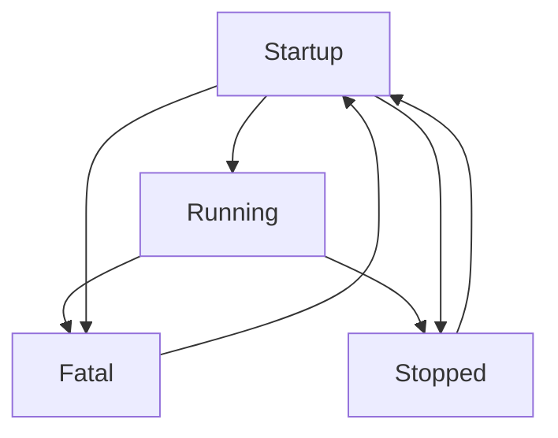

# Microgrid Optimiser 

The following document outlines the software requirements and design of a micro-grid optimizer controller. The primary function of this controller is to optimize the operation of a micro-grid that may include multiple batteries, PV inverters, generators, and energy monitors. The controller adjusts the generator runtimes to meet the user-defined requirements, including:

  * Minimizing diesel usage
  * Allowing quiet times to be scheduled, during which the user prefers the generators not to be run
  * Minimizing the number of times the generators are started and stopped
  * Preventing the battery from being discharged below a configurable minimum SOC or recharged above a configurable    maximum SOC.

To achieve these objectives, the controller must predict the loads and amount of solar the micro-grid will encounter within a configurable time window into the future. This allows the controller to optimally schedule when and how much to recharge the battery. Without an accurate prediction of the loads and solar, the controller may waste fuel by overcharging the battery or may repeatedly start and stop the generators within a short period of time by undercharging the battery.

This controller obtains predicted weather information from online sources to accurately forecast solar panel power production for a configurable time horizon (usually the next 24 hours). The controller requires internet access to obtain weather data. If weather data is unavailable, the controller will use its own estimated weather data, which is typically less reliable.

The controller only adjusts the start times, run durations, and generator output levels within predefined limits of these adjustable parameters. If the controller incorrectly predicts the weather or loads, it may not achieve the desired results, resulting in more diesel being used than desired or the generators running when they should not be.

The controller communicates with one or more battery master controllers, which communicate with lower-level battery management systems (BMS), battery inverters, PV inverters, and generators. The micro-grid optimizer communicates with the battery master controller(s) over Modbus TCP Ethernet. The optimizer also communicates over the internet to request weather forecast data from weather forecast services to optimize micro-grid operation over a configurable time horizon (usually 24 hours). The optimization process uses a Monte Carlo simulation with configurable constraints and the number of simulations. The micro-grid optimizer can communicate with multiple weather forecast services with configurable priority order. If no weather forecast services are available, the micro-grid optimizer will use its own predicted solar forecast based on previously collected data.

A simplified micro-grid is shown below.  

An example of the output of the micro-grid optimiser is shown in the following graph. It shows the predicted micro-grid energy usage of the loads and solar PV power output into the next 24 hours.
It also shows when the micro-grid optimiser predicts the best time to run the generators is in order to recharge the battery. This "schedule" is determined by the micro-grid optimiser by simulating the micro-grid 
operation over a configurable time horizon (usually 24 hours) and finding the optimal recharge schedule that minimises the number of times the generators are run and the amount of time the generators are run. The micro-grid optimiser will then set the battery master controller to run the generators at the times specified in the schedule.

Above we can see the optimal recharge schedule (the time and period that the generators should recharge the battery for) is predicted to be from about 11pm to 1am (shown in green). 
The State of charge SOC of the battery is predicted over this 24 hour period and it can be seen to increase over this period that the generators recharge the battery (11pm to 1am). 
Note that the SOC of the battery never reaches less then 10% and starts to increase once the solar PV panels start producing power again the following morning around 8am.
The micro-grid optimiser runs an optimisation procedure to produce the best recharge schedule and the above predictions at set intervals (usually every 3 hours). It regularly checks the last determined best schedule and checks if it is time to start this recharge schedule. If so it will set the battery master controllers recharge low and high state of charge SOC setpoints in order to run the generators at the times specified in the above schedule.  

## Microgrid Optimiser Control Hierarchy
The controller has the following control hierarchy (use a markdown mermaid diagram supported render to see the image below).  
 

## Microgrid Optimiser Inputs and Outputs
The micro-grid optimiser is responsible for reading the following from a battery master controller:

  * Requesting weather forecast data from the weather forecast services
  * Requesting battery state of charge (SOC) from the battery master controllers
  * Requesting PV generation data from the battery master controllers
  * Requesting generator data from the battery master controllers
  * Requesting energy monitor data from the battery master controllers to determine the energy consumption of the micro-grid.
  * Requesting battery master controller maximum solar power limits and solar power curbing parameters in order to simulate the effect of a battery master controller curbing solar power.
  * Requesting battery master controller maximum generator power limits and nominal generator power in order to simulate the effect of a battery master controller commanding a recharge from a generator.

The micro-grid optimiser is responsible for writing the following to a battery master controller:

  * A minimum SOC setpoint under which the battery master controller will start a generator to recharge the batteries.
  * A maximum SOC setpoint over which the battery master controller will stop the generators.

The micro-grid optimiser is responsible for setting these above parameters at the correct time according to the recharge schedule it has determined to be optimal. The reason it does not directly command starting and stopping of the generators is to reduce that chance that the microgrid optimiser could incorrectly command a generator to start or stop due to a bug or communication issues. In the case that the battery master controller can no longer communicate with the micro-grid optimiser, the battery master controller will simply use the last received setpoints and continue to operate as normal. These SOC setpoints can never be outside a configurable range (within 0% - 100% SOC) and so worse case is the generators run longer then they had to.

## Microgrid Optimiser Control Parameters

The microgrid optimiser determines the optimal time to run the generators by minimising the following objective function:

  * Minimise the number of times the generators are run
  * Minimise the amount of time the generators are run
  * Minimise the amount of time the generators are run at certain times (e.g. during the day)
  * Minimise the time the generators are run during configurable designated quiet times (e.g. 10pm - 6am)
  

| Parameter                         | Description                                                                                                                                                                                                                                                                                                                      | Data Types | Valid Values     | Default Value             |
| --------------------------------- | -------------------------------------------------------------------------------------------------------------------------------------------------------------------------------------------------------------------------------------------------------------------------------------------------------------------------------- | ---------- | ---------------- | ------------------------- |
| `weather_forecast_provider`       | The weather forecast provider to use. This is a list of weather forecast providers in order of priority. The microgrid optimiser will use the first weather forecast provider that is available. If none are available or specified then the micro-grid optimiser uses it's own predicted solar forecast based on previous data. | list(str)  | list of strings  | Default [] No providers   |
| `sim_time_resolution_mins`        | The resolution period that the microgrid optimiser runs simulations at in order to optimise the microgrid. This is the period of time that the microgrid optimiser will simulate the microgrid for in order to find the optimal control strategy.                                                                                | int        | 0 - max(int)     | none (must specify)       |
| `num_hours`                       | The number of hours to simulate the microgrid for in order to find the optimal control strategy.                                                                                                                                                                                                                                 | int        | 0 - max(int)     | none (must specify)       |
| `max_recharge_schedules`          | The maximum number of times that the optimiser will simulate the generators starting over the num_hours period. This is used to find the optimal control strategy for the microgrid. Control strategies that required more then this number of generator starts will not be considered by the optimiser.                         | int        | 0 - max(int)     | none (must specify)       |
| `quiet_hours_list`                | The hours of the day that are considered quiet hours and the recharge schedule should not run generators over these hours if possible.                                                                                                                                                                                           | list(int)  | list of 0 - 23   | Default [] No quiet hours |
| `quiet_hours_penalty`             | The penalty to apply to the cost function for running generators during quiet hours. The max penalty is equal to the num_hours parameter. A low penalty is 0.1                                                                                                                                                                   | float      | 0.0 - max(float) | none (must specify)       |
| `early_recharge_penalty`          | A penalty to apply to earlier recharge schedules. This is used to encourage the optimiser to find a control strategy that runs the generators later rather then earlier (better to wait and see rather then recharge early). A low penalty is 1.0 high is 10.0                                                                   | float      | 0.0 - max(float) | none (must specify)       |
| `cycle_count_penalty`             | A penalty to apply to the cost function for running hte generators multiple times. A low penalty is 0.1 high is 1.0                                                                                                                                                                                                              | float      | 0.0 - max(float) | none (must specify)       |
| `num_simulations`                 | The number of simulations to run in order to find the optimal control strategy.                                                                                                                                                                                                                                                  | int        | 0 - max(int)     | none (must specify)       |
| `min_soc_allowed`                 | The minimum allowed state of charge for the battery. The microgrid optimiser should prevent the battery SOC from ever getting below this value.                                                                                                                                                                                  | float      | 0.0 - 100.0      | none (must specify)       |
| `max_soc_allowed_during_recharge` | The maximum allowed state of charge for the battery during the recharge schedule. The microgrid optimiser should prevent the battery SOC from ever getting above this value during the recharge schedule.                                                                                                                        | float      | 0.0 - 100.0      | none (must specify)       |

## Microgrid Optimiser Control Algorithm

The microgrid optimiser controller runs the following high level state diagram:

### Startup State
  * Check that all required parameters are set and if not then go to the Fatal state.
  * Stay in the statup state until all the comms are healthy or the timeout time is reached.

### Running State
  * Run the control loop process.
    Control loop process
      1. Get all required inputs from sub controllers.
         Loads, Solar Power, Battery Power, Battery State of Charge, 
      2. Store the inputs from the sub controllers in the local power predictor.

      3. Determine if it is time to get new weather forecast data and if so update forecast data.
      4. Determine if it is time to run the optimiser.
         The optimiser runs at a set period. It will not run if the generators are producing power currently (i.e no current recharge schedule is currently running). Once the generators stop and if more then the optimiser period has passed then the optimiser will run again.
         This prevents problems with the optimiser running during a recharge schedule and then changing the recharge schedule causing the generators to start and stop multiple times.

      5. Send the optimiser results to the sub controllers.
      6. Update the modbus registers with the optimiser results.
      7. Update the local databases with the optimiser results. 

### Fatal State
  * Restart the controller.

# Microgrid Optimiser Inputs and Outputs

This controller expects to talk to a battery controller which can provide with the following software Interface. This software interface for now is expected to be modbus TCP but may include others in the future.

| Name                               |                                                                                                        Description                                                                                                        | Units | Read/Write |
| ---------------------------------- | :-----------------------------------------------------------------------------------------------------------------------------------------------------------------------------------------------------------------------: | ----: | ---------: |
| battery_real_power                 |                                                                                                    Battery Real Power                                                                                                     |     W |          R |
| battery_reactive_power             |                                                                                                  Battery Reactive Power                                                                                                   |   VAr |          R |
| battery_soc                        |                                                                                                  Battery State of Energy                                                                                                  |     % |          R |
| solar_real_power                   |                                                                                                     Solar Real Power                                                                                                      |     W |          R |
| solar_reactive_power               |                                                                                                   Solar Reactive Power                                                                                                    |   VAr |          R |
| solar_real_power_limit             |                                                                                                  Solar Real Power Limit                                                                                                   |     W |          R |
| generator_real_power               |                                                                                                   Generator Real Power                                                                                                    |     W |          R |
| generator_reactive_power           |                                                                                                 Generator Reactive Power                                                                                                  |   VAr |          R |
| generator_active_count             |                                                                        Generator Active Count. The number of generators currently producing power                                                                         | Count |          R |
| load_real_power                    |                                                                                                      Load Real Power                                                                                                      |     W |          R |
| load_reactive_power                |                                                                                                    Load Reactive Power                                                                                                    |   VAr |          R |
| battery_start_gen_recharge_low_soc |                                                                 The battery low SOC threshold below which the generators turn on to recharge the battery.                                                                 |     % |         RW |
| battery_stop_gen_recharge_high_soc |                                                              The battery high SOC threshold above which the generators turn off to stop recharging battery.                                                               |     % |         RW |
| battery_limit_pv_high_soc          |    The battery config parameter soc (%) threshold to use for when the battery should start to limit the amount of pv power that is allowed to be produced. Linearly limit between the start and end pv SOC thresholds.    |     % |         RW |
| battery_limit_pv_crit_soc          |         The battery config parameter soc (%) threshold to use when any strings soc is at or above this limit the max pv power produced to 0 kW that. Linearly limit between the start and end pv SOC thresholds.          |     % |         RW |
| system_baseload_nominal_power      | The battery config parameter setting the nominal baseload combined power of the generators to recharge the battery. This is the total combined power from all the generators that is requested to recharge the system at. |    kW |         RW |
